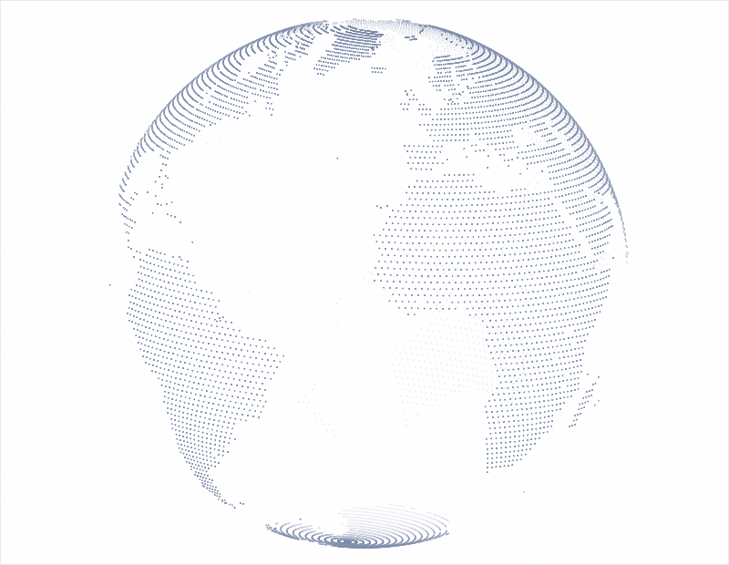
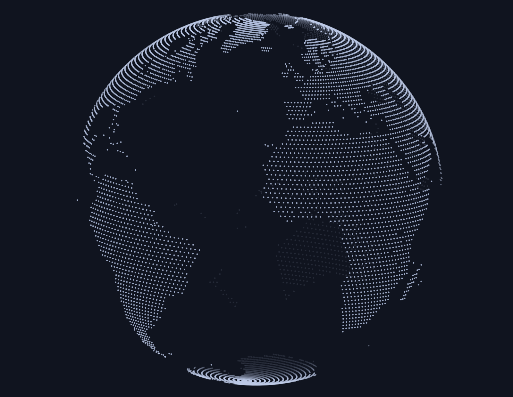

# dot-globe

A React point-cloud Earth with bundled Natural Earth geography and no runtime map downloads.

[Live demo](https://hmwcs.github.io/dot-globe/)



|                         Light                         |                        Dark                         |
| :---------------------------------------------------: | :-------------------------------------------------: |
|  |  |

## Add to your React project

The package is not published to npm yet. With Node.js 22.13+ and pnpm 11.16.0, create an installable archive:

```sh
git clone https://github.com/HMWCS/dot-globe.git
cd dot-globe
pnpm install --frozen-lockfile
pnpm --filter @hmwcs/dot-globe build
pnpm --dir packages/dot-globe pack --pack-destination ../..
```

This creates `hmwcs-dot-globe-0.0.0.tgz` in the repository root. In your existing React project:

```sh
npm install /path/to/dot-globe/hmwcs-dot-globe-0.0.0.tgz
```

For pnpm, use `pnpm add` with the same archive path. Supported React versions: `^18.3.0 || ^19.0.0`.

```tsx
import { DotGlobe } from "@hmwcs/dot-globe";

export function Earth() {
  return (
    <div style={{ width: 320, maxWidth: "100%", background: "#0b1018" }}>
      <DotGlobe theme="dark" autoRotate={false} />
    </div>
  );
}
```

The globe fills its container width and defaults to a square; supply the background. Use a client component in frameworks with React Server Components.

See [advanced usage](packages/dot-globe/docs/usage.md) for city presets, coordinates, motion, appearance, and accessibility.

## Run the demo locally

After installing this repository's dependencies, run `pnpm dev` and open the printed URL. Drag or use arrow keys to rotate; controls select the view, quality, theme, and motion. Stop with `Ctrl+C`.

## Development

```sh
pnpm check
pnpm --filter dot-globe-example build
```

The static demo build is `examples/react-vite/dist`. Geography generation and verification are documented in [data provenance](docs/data-provenance.md).

## Attribution

Project code is available under the [MIT License](LICENSE). Natural Earth data is public domain and documented separately. Dependency attributions are listed in [third-party notices](THIRD_PARTY_NOTICES.md).
